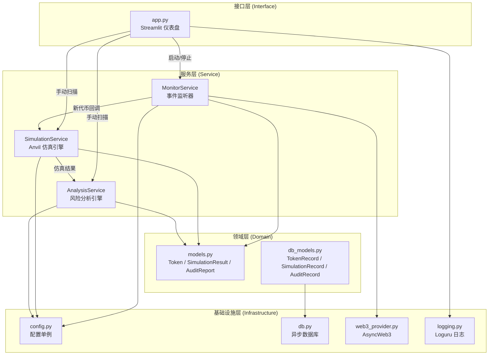
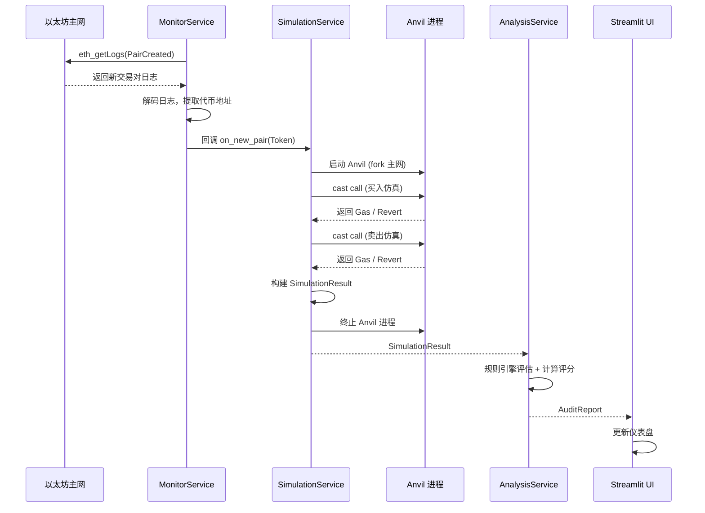
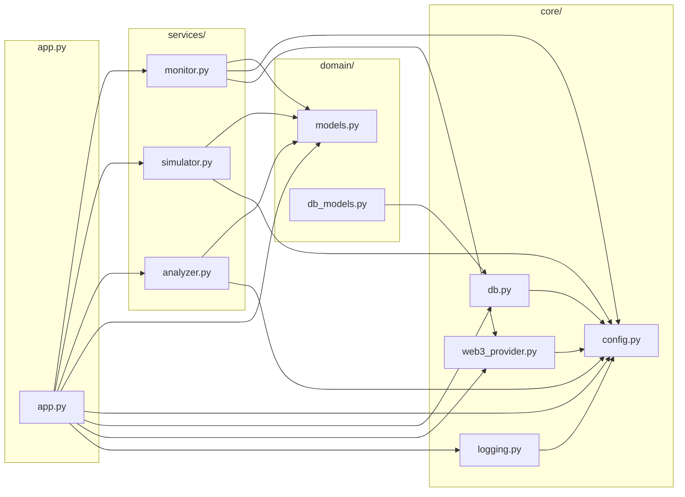

# MemeScan — 项目架构设计文档

> **团队共识文档** — 供两位开发者在黑客松 7 天周期内对齐目标和开发方向。
> 最后更新: 2026-02-17

---

## 一、项目愿景与设计目的

### 1.1 我们在做什么？

**MemeScan (The Rug-Pull Radar)** 是一个实时 Memecoin 安全扫描智能体。它的核心使命是：

> **在用户买入一个新代币之前，自动检测该代币是否是骗局（Rug Pull / 蜜罐）。**

具体来说，系统做三件事：

1. **监控** — 实时监听以太坊上 Uniswap V2 Factory 合约的 **PairCreated** 事件，发现新上线的代币
2. **仿真** — 通过 Anvil 分叉主网，在隔离环境中模拟"买入 → 卖出"交易，检测能否正常卖出、税率多高、Gas 是否异常
3. **分析** — 基于仿真结果生成结构化的安全审计报告，给出 0-100 的风险评分

### 1.2 为什么这样设计？

核心设计原则只有三条：

| 原则 | 含义 | 体现 |
|------|------|------|
| **安全第一** | 永远不向主网发送真实交易 | 所有交易仿真都在 Anvil 分叉上执行 |
| **模块化** | 每个服务独立、可测试、可替换 | Service-Repository 分层架构 |
| **Fail-Safe** | 系统崩溃时不丢关键数据 | 指数退避重连 + 优雅关闭 + 异步数据库持久化 |

---

## 二、系统架构总览



### 数据流（从检测到报告）



---

## 三、分层架构详解

### 3.1 基础设施层 — `core/`

这一层为整个应用提供**底层支撑**，不包含任何业务逻辑。

#### `core/config.py` — 配置中枢

| 要素 | 说明 |
|------|------|
| **核心类** | **AppSettings** (继承 BaseSettings) |
| **设计模式** | `@lru_cache` 单例 — 全局只实例化一次 |
| **数据来源** | `.env` 文件 → 环境变量 → 代码默认值（优先级从高到低） |
| **关键配置项** | RPC URL、Anvil 端口、轮询间隔、税率阈值、数据库路径、LLM 密钥 |

**被谁依赖**: 几乎所有模块 — 它是全局配置的唯一入口。

#### `core/db.py` — 异步数据库引擎

| 要素 | 说明 |
|------|------|
| **核心组件** | **Base** (声明式基类)、**async_engine**、**async_sessionmaker** |
| **关键函数** | `get_session()` — 异步上下文管理器，自动 commit / rollback / close |
| **初始化** | `init_db()` — 在应用启动时创建所有数据表 |
| **清理** | `shutdown_db()` — 释放连接池 |

**设计决策**: 使用 **aiosqlite** 而非 asyncpg。SQLite 零配置，适合黑客松 MVP；异步 SQLAlchemy 抽象层意味着后续切换 Postgres 只需改一行连接字符串。

#### `core/web3_provider.py` — Web3 连接

| 要素 | 说明 |
|------|------|
| **核心函数** | `get_async_web3()` — 返回缓存的 AsyncWeb3 实例 |
| **Provider** | AsyncHTTPProvider（非阻塞 JSON-RPC） |
| **健康检查** | `check_connection()` — 验证节点是否响应 |

**被谁依赖**: MonitorService（轮询事件）和 app.py（状态面板显示连接状态）。

#### `core/logging.py` — 日志系统

| 要素 | 说明 |
|------|------|
| **双通道输出** | stderr（彩色人类可读）+ 文件（JSON 结构化，按天轮转） |
| **初始化** | `setup_logging()` — 在 app.py 启动时调用一次 |

---

### 3.2 领域层 — `domain/`

这一层定义了**核心数据契约**，是所有服务之间传递数据的"语言"。

#### `domain/models.py` — Pydantic V2 领域模型

三个核心模型 + 一个枚举：

```
┌──────────────────────┐
│     RiskFlag (枚举)    │  HONEYPOT, HIGH_BUY_TAX, CANNOT_SELL, ...
└──────────────────────┘

┌──────────────────────┐
│     Token            │  address, symbol, pair_address, deployer, ...
│     (代币元数据)       │  所有地址字段通过 field_validator 自动小写化
└──────────────────────┘
           │
           ▼ 传入仿真
┌──────────────────────┐
│  SimulationResult    │  can_buy, can_sell, buy_tax_pct, sell_tax_pct,
│  (仿真输出)           │  buy_gas, sell_gas, is_honeypot, revert_reason
└──────────────────────┘
           │
           ▼ 传入分析
┌──────────────────────┐
│    AuditReport       │  token + simulation + risk_score + risk_flags
│    (审计报告)         │  + llm_summary + is_dangerous 属性
└──────────────────────┘
```

**关键设计**: 所有模型设置 `frozen=True`（不可变），避免在服务间传递时被意外修改。

#### `domain/db_models.py` — SQLAlchemy ORM 模型

| ORM 类 | 对应领域模型 | 数据表名 |
|--------|------------|---------|
| **TokenRecord** | Token | tokens |
| **SimulationRecord** | SimulationResult | simulations |
| **AuditRecord** | AuditReport | audits |

ORM 模型的字段与领域模型一一对应，但增加了自增主键 **id** 和数据库索引。

---

### 3.3 服务层 — `services/`

这一层是**核心业务逻辑**所在，三个服务各司其职。

#### `services/monitor.py` — 事件监听器

| 要素 | 说明 |
|------|------|
| **核心类** | **MonitorService** |
| **核心方法** | `start()` — 启动轮询循环（阻塞式）<br/>`stop()` — 发出关闭信号 |
| **工作方式** | 每 N 秒调用 `eth_getLogs` 查询新的 PairCreated 事件 |
| **过滤逻辑** | 只处理包含 WETH 的交易对（忽略 Token/Token 对） |
| **容错机制** | 指数退避重连：失败后等待 1s → 2s → 4s → ... → 最大 60s |
| **关闭方式** | 通过 `asyncio.Event` 实现优雅关闭，不会丢弃正在处理的事件 |
| **输出** | 通过回调 `on_new_pair(Token)` 将新代币分发给下游 |

**协作关系**: MonitorService 发现新代币 → 调用回调 → 触发 SimulationService。

#### `services/simulator.py` — Anvil 仿真引擎

| 要素 | 说明 |
|------|------|
| **核心类** | **SimulationService** |
| **设计模式** | **异步上下文管理器** (`async with SimulationService() as sim`) |
| **生命周期** | `fork_mainnet()` 启动 Anvil → 执行仿真 → `kill_anvil()` 终止 |
| **仿真流程** | 1. `cast call` 仿真买入 (swapExactETHForTokens)<br/>2. `cast call` 仿真卖出 (swapExactTokensForETH) |
| **蜜罐判定** | `can_buy=True` 且 `can_sell=False` → 蜜罐 |
| **异常处理** | 子进程超时 → 强制 kill；cast 失败 → 解析 stderr 中的 Revert 原因 |

**关键实现细节**:
- Anvil 以 `--no-mining` 模式启动，保证仿真结果的确定性
- 使用 Anvil 预充值账户 `0xf39F...` 作为仿真发送者
- 每次仿真都会新建一个 Anvil 分叉实例（上下文管理器保证清理）

#### `services/analyzer.py` — 风险分析引擎

| 要素 | 说明 |
|------|------|
| **核心类** | **AnalysisService** |
| **核心方法** | `analyze(Token, SimulationResult) → AuditReport` |
| **规则引擎** | `_evaluate_rules()` — 根据仿真结果生成风险标签列表 |
| **评分系统** | `_compute_score()` — 加权求和（蜜罐 40 分，高税 15 分，...） |
| **LLM 集成** | `_generate_summary()` — 当前为规则生成的文字摘要，预留了 RAG 接口 |

**评分权重表**:

| 风险标签 | 分值 |
|---------|------|
| HONEYPOT / CANNOT_SELL | 40 |
| HIDDEN_MINT | 25 |
| HIGH_BUY_TAX / HIGH_SELL_TAX | 15 |
| OWNERSHIP_NOT_RENOUNCED / PROXY_CONTRACT / BLACKLIST_FUNCTION / TRANSFER_PAUSABLE | 10 |
| ANTI_WHALE_LIMIT | 5 |
| 无法完成买入（附加分） | +30 |

---

### 3.4 接口层 — `app.py`

| 要素 | 说明 |
|------|------|
| **框架** | Streamlit |
| **状态管理** | `st.session_state` 存储报告列表、监控状态、事件日志 |
| **异步方案** | 后台守护线程运行独立的 `asyncio` 事件循环 |
| **侧边栏** | RPC 连接状态、启动/停止监控、手动扫描输入 |
| **主面板** | 指标概览（总扫描数、蜜罐数、高风险数）+ 可展开的审计报告卡片 + 事件日志 |

**线程模型**:
```
主线程 (Streamlit UI 渲染)
│
└─ 守护线程 (asyncio event loop)
   ├─ MonitorService.start()    — 持续轮询
   ├─ SimulationService         — 按需启动 Anvil
   └─ AnalysisService           — 按需分析
```

---

## 四、文件依赖关系全景图



---

## 六、关键设计模式速查

| 模式 | 位置 | 作用 |
|------|------|------|
| **@lru_cache 单例** | config.py, web3_provider.py | 全局唯一实例，无需 DI 框架 |
| **异步上下文管理器** | SimulationService, get_session() | 确保资源（Anvil 进程、数据库会话）必定被清理 |
| **指数退避** | MonitorService._handle_error() | 应对 RPC 限速和网络波动 |
| **回调分发** | MonitorService → on_new_pair | 解耦事件监听和业务处理 |
| **不可变数据模型** | models.py (frozen=True) | 防止服务间传递数据时被意外修改 |
| **后台线程 + 事件循环** | app.py | 解决 Streamlit 同步框架与 asyncio 异步服务的兼容问题 |

---

## 七、启动方式

```bash
# 1. 安装依赖
pip install -r requirements.txt

# 2. 配置环境变量
cp .env.example .env
# 编辑 .env 填入 RPC URL

# 3. 确认 Foundry 已安装
anvil --version && cast --version

# 4. 启动应用
streamlit run app.py
```

---

## 八、后续扩展方向

- [ ] **WebSocket 监听**: 将 HTTP 轮询升级为 WebSocket 订阅，降低延迟
- [ ] **税率精确计算**: 在仿真中比较买入前后的代币余额差，精确计算滑点和税率
- [ ] **合约源码分析**: 通过 Etherscan API 拉取已验证源码，用 LLM 分析可疑函数
- [ ] **多链支持**: 扩展到 BSC / Base / Arbitrum（只需更换 RPC 和工厂合约地址）
- [ ] **Telegram Bot**: 将审计报告通过 Telegram 推送告警
- [ ] **Docker 部署**: 容器化整个应用栈
